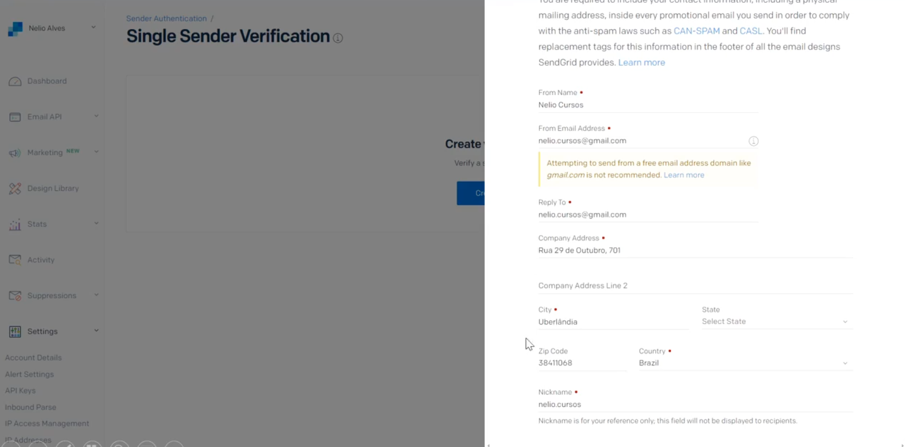
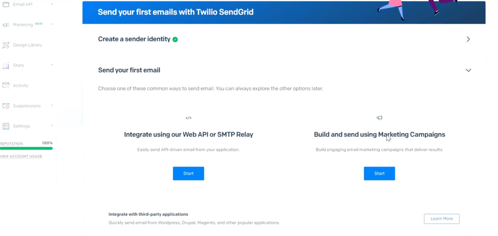
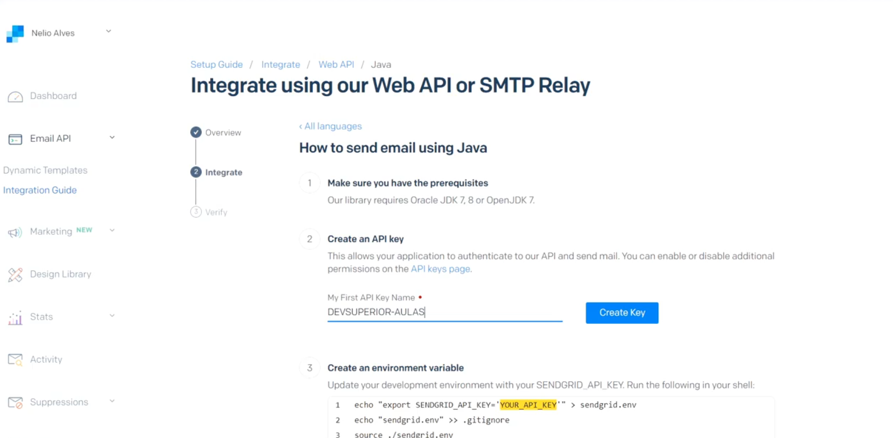
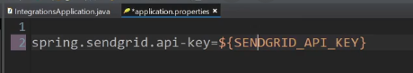
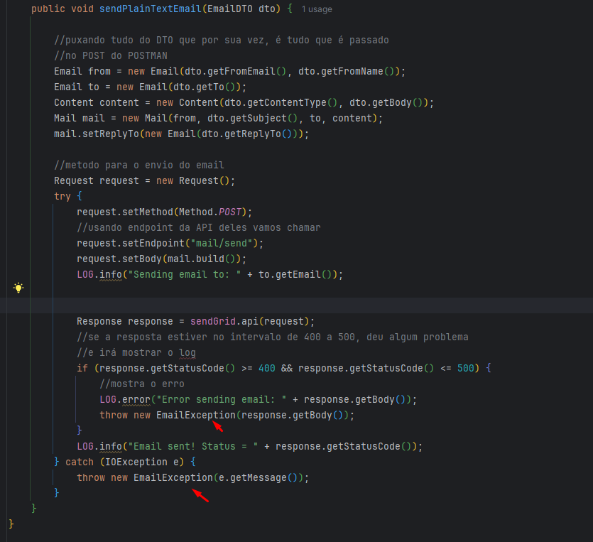

<p align="center">
  
</p>

__# Objetivo: Envio de Email

[Sendgrid](https://sendgrid.com/en-us/1?adobe_mc_sdid=SDID%3D27FBAF809162C9AF-47BCCF89170A8B5D%7CMCORGID%3D32523BB96217F7B60A495CB6%40AdobeOrg%7CTS%3D1729277733&adobe_mc_ref=https%3A%2F%2Fwww.google.com%2F)

1. Start for free > criar conta > depois colocar 2FA.

2. Cadastrar single sender verification

Isso é tipo um remetente dos e-mails.



O ideal é que você tenha um domínio próprio, gmail não é muito recomendado (como é para estudo, pode usar).

3. Ir no guide para escolher API ou campanha de marketing (escolher API).



4. Depois de escolher API ele vai oferecer Web API ou SMTP Relay, escolha WEB API e depois Java
5. Crie uma chave API, onde será gerado um código



Inserir esse código como variável de ambiente no windows.

6. Ir em variáveis de ambiente > novo > criar: SENDGRID_API_KEY e o valor dela é o código gerado pelo site.
7. Dentro do projeto ir em application.properties e criar uma variável:



## JSON envio de email

No fromEmail, passa o email que você cadastrou no site.

```json
{
  "fromEmail" : "nome@dominio.com",
  "fromName" : "Nome",
  "replyTo" : "nome@dominio.com",
  "to" : "destinatario@gmail.com",
  "subject" : "Meu assunto",
  "body" : "Meu conteúdo do email com <strong>palavra forte</strong> destacada.",
  "contentType" : "text/html"
}
```

# Enviando primeiro email - SendGrid

Colocar dependência no POM.

```xml
		<dependency>
			<groupId>com.sendgrid</groupId>
			<artifactId>sendgrid-java</artifactId>
		</dependency>
```

(Verificar depois o Java Email Sender)

## Criar Service

Criar um service injetando o SendGrid com Autowired e utiliza o que o SendGrid fornece para a gente em como enviar
o email.

```java
public class EmailService implements EmailService {

	//criamos isso para verificar o que aconteceu ao enviar o email
	private Logger LOG = LoggerFactory.getLogger(SendGridEmailService.class);

	@Autowired
	private SendGrid sendGrid;

	public void sendPlainTextEmail(EmailDTO dto) {

		//puxando tudo do DTO que por sua vez, é tudo que é passado
		//no POST do POSTMAN
		Email from = new Email(dto.getFromEmail(), dto.getFromName());
		Email to = new Email(dto.getTo());
		Content content = new Content(dto.getContentType(), dto.getBody());
		Mail mail = new Mail(from, dto.getSubject(), to, content);
		mail.setReplyTo(new Email(dto.getReplyTo()));

		//metodo para o envio do email
		Request request = new Request();
		try {
			request.setMethod(Method.POST);
			//usando endpoint da API deles vamos chamar
			request.setEndpoint("mail/send");
			request.setBody(mail.build());
			LOG.info("Sending email to: " + to.getEmail());


			Response response = sendGrid.api(request);
			//se a resposta estiver no intervalo de 400 a 500, deu algum problema
			//e irá mostrar o log
			if (response.getStatusCode() >= 400 && response.getStatusCode() <= 500) {
				//mostra o erro
				LOG.error("Error sending email: " + response.getBody());
				throw new EmailException(response.getBody());
			}
			LOG.info("Email sent! Status = " + response.getStatusCode());
		} catch (IOException e) {
			throw new EmailException(e.getMessage());
		}
	}
}
```

## Controller

Injetar o service e fazer o endpoint.

```java
@RestController
@RequestMapping(value = "/emails")
public class EmailResource {

	@Autowired
	private EmailService service;
	
	@PostMapping
	public ResponseEntity<EmailDTO> insert(@RequestBody EmailDTO dto) {
		service.sendPlainTextEmail(dto);
		return ResponseEntity.noContent().build();
	}
}
```

## Tratando exceções

Criar um subpacote exceptions em service com EmailException e é o de sempre que a gente conhece.

```java
public class EmailException extends RuntimeException {
	private static final long serialVersionUID = 1L;

	public EmailException(String msg) {
		super(msg);
	}
}
```

Para capturar ela, é só criar o ControllerExceptionHandler com ControllerAdvice

Criar o StandardError com os dados (timestamp, status, error, message, path) com construtor vazio + getters e setters.

```java
@ControllerAdvice
public class ResourceExceptionHandler {

	@ExceptionHandler(EmailException.class)
	public ResponseEntity<StandardErrorDTO> email(EmailException e, HttpServletRequest request) {
		HttpStatus status = HttpStatus.BAD_REQUEST;
		StandardErrorDTO err = new StandardErrorDTO();
		err.setTimestamp(Instant.now());
		err.setStatus(status.value());
		err.setError("Email error");
		err.setMessage(e.getMessage());
		err.setPath(request.getRequestURI());
		return ResponseEntity.status(status).body(err);
	}	
}
```

Por fim, lançar a EmaiLException no service



## Padrão de projeto Strategy para usar mais de um EmailService

A ideia não é a gente ficar gastando a API fazendo envio dos e-mails, e sim pegando o "log" falando que o email foi enviado
corretamente de forma simulada.

Para isso, usaremos o Strategy.

Criaremos uma interface com os métodos que quisermos, injetando ela de acordo com o perfil de projeto que estivermos
usando.

Se for um perfil de test: mock.

Se for um perfil de dev (produção): enviaremos o email de verdade. 

A classe que antes se chamava EmailService, se chamará SendGridEmailService.

E criaremos uma interface chamada EmailService:

```java
public interface EmailService {

	void sendPlainTextEmail(EmailDTO dto);
}
```

No SendGridEmailService (antes EmailService), tiraremos a anotação @Service, pois criaremos o bean manualmente e ela
implementará EmailService.

No Controller, injetaremos a interface com @Autowired!

**E o padrão Strategy?**

Iremos considerar a classe SendGridEmailService como a do perfil Dev (produção).

Para isso, criaremos um pacote config com uma classe chamada DevConfig.

Passaremos o @Profile para caso no application.properties tenha profile dev, ela será selecionada.

E como podemos ver, ela retorna SendGridEmailService.

```java
@Configuration
@Profile("dev")
public class DevConfig {

	@Bean
	public EmailService emailService() {
		return new SendGridEmailService();
	}
}
```

Para testes, criaremos a classe TestConfig. Ela terá o profile Test e retorna o MockEmailService.

```java
@Configuration
@Profile("test")
public class TestConfig {

	@Bean
	public EmailService emailService() {
		return new MockEmailService();
	}
}
```

Classe Service de teste (Mock), no pacote services.

```java
public class MockEmailService implements EmailService {

	private Logger LOG = LoggerFactory.getLogger(MockEmailService.class);

	public void sendPlainTextEmail(EmailDTO dto) {
		LOG.info("Email sent to: " + dto.getTo());
	}
}
```

